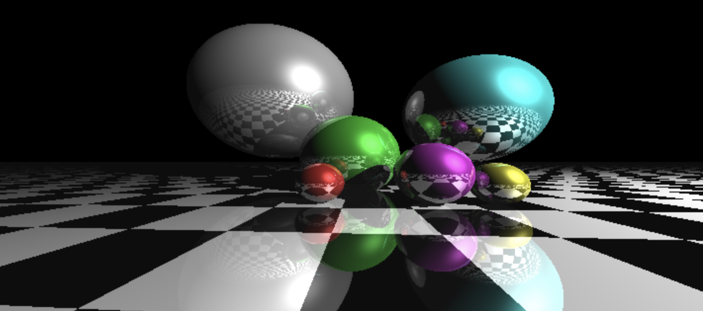
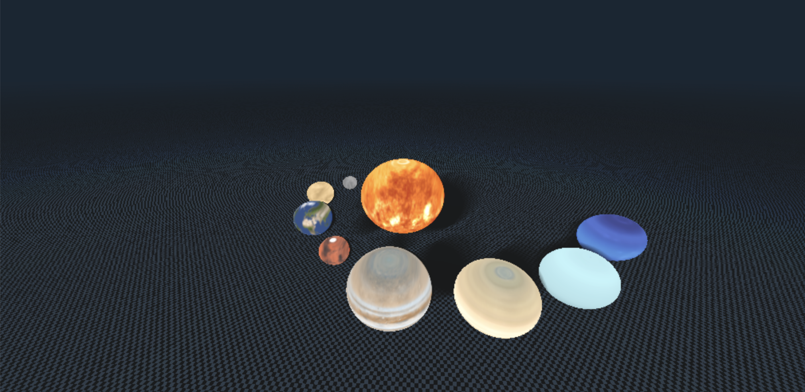

This coursework was the final piece of work for the [Computer Graphics](https://wp.doc.ic.ac.uk/bkainz/teaching/60005-co317-computer-graphics/) module at Imperial College. I received a 100% mark, and an honorable mention for Task 2. 

For Task 1, I had to implement a simple GPU-based Ray Tracing scene, according to a pre-specified scene. 

For Task 2, we were asked to implement our own scene, and add any technical extensions to it. Due to my passion for space, I decided to create a solar system-like scene (obviously ignoring the proper orbits of the planets). Compared to Task 1, I added to the ray tracing task: soft shadows, fog (dark blue) and spherical texture mapping (to make each sphere look like the sun or the respective planet).

